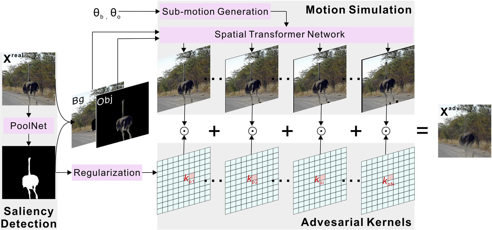
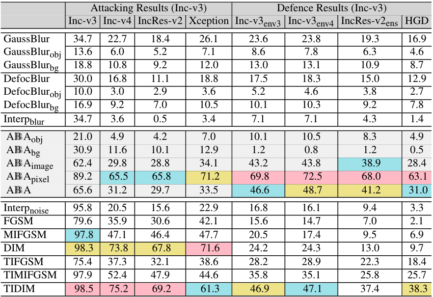

# Watch out! Motion is Blurring the Vision of Your Deep Neural Networks

This repository is the official implementation of [Watch out! Motion is Blurring the Vision of Your Deep Neural Networks](https://arxiv.org/abs/2002.03500). 



## Requirements

We use python 3.6 and pytorch 0.4.1 on Ubuntu 16.04. with NVIDIA Tesla P40 and M40. 

To install requirements:

```setup
pip install -r requirements.txt
```
and the PoolNet for saliency object detection is required: 
https://github.com/backseason/PoolNet.git
Please put the poolnet code to the './tools/saliency' folder.

The foolbox2.3.0 is also required. After installing, please replace the installed '/foolbox2.3.0/attacks/iterative_projected_gradient.py' with our new version './foolbox2.3.0/attacks/iterative_projected_gradient.py'.

The DeblurGAN and DeblurGANv2 are also required for the discussion of effects to Deblurring methods:
https://github.com/KupynOrest/DeblurGAN.git
https://github.com/VITA-Group/DeblurGANv2.git

An implementation of the spatial transformer is also needed: https://github.com/kamenbliznashki/spatial_transformer 

## Subject Models

In the paper, we attack four models, i.e., Inception v3 (Inc-v3), Inception v4 (Inc-v4), Inception ResNet v2 (IncRes-v2), and Xception. We use the models pre-trained on imagenet and provided by the pytorchcv: https://github.com/osmr/imgclsmob.git

## Dataset

We evaluate our method on NeurIPS 2017 adversarial competition dataset : https://www.kaggle.com/c/nips-2017-non-targeted-adversarial-attack

## Evaluation

Please test and evaluate the method via the script in './experiments/'

## Results

We present the partial evaluation results in the following and more results could be found in the supplementary material.





### Bibtex
```latex
@inproceedings{Guo2020NeurIPS,
  title={Watch out! Motion is Blurring the Vision of Your Deep Neural Networks},
  author={Qing Guo and Felix Juefei-Xu and Xiaofei Xie and Lei Ma and Jian Wang and Bing Yu and Wei Feng and Yang Liu},
  booktitle={Advances in Neural Information Processing Systems 34},
  year={2020},
}
```